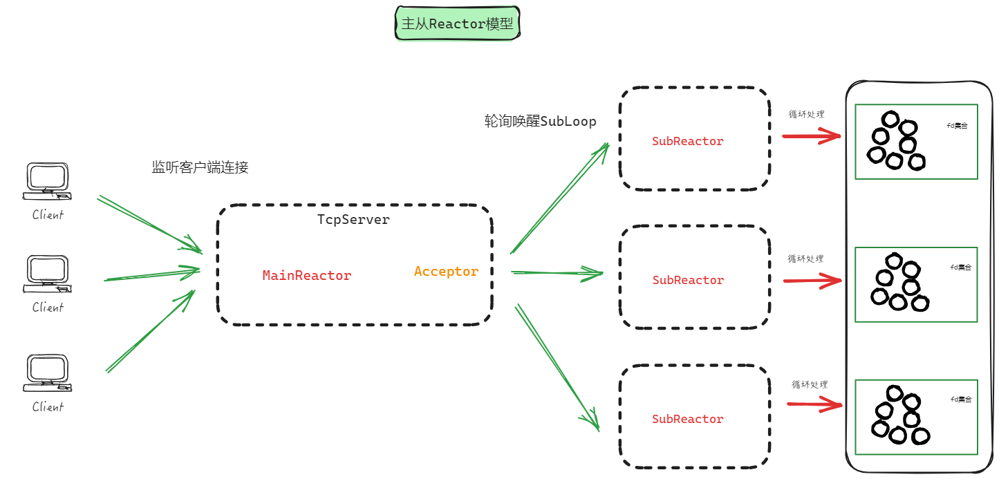

# 理解Muduo

服务端的Epoll网络编程的基础代码，里面网络通信的流程一个不可少，将其划分寻找Muduo中对应的类

我们理解Muduo库要从下往上，将可独立存在的类先划分出来解读，接着理解紧密相连的类就相对容易

```c++
#include <iostream>
#include <cstring>
#include <unistd.h>
#include <sys/socket.h>
#include <netinet/in.h>
#include <sys/epoll.h>
#include <fcntl.h>

const int MAX_EVENTS = 10;
const int PORT = 8080;

// 设置套接字为非阻塞模式
void setNonBlocking(int sockfd) {
    int flags = fcntl(sockfd, F_GETFL, 0);
    fcntl(sockfd, F_SETFL, flags | O_NONBLOCK);
}

int main() {
    // 创建服务器套接字
    int serverSocket = socket(AF_INET, SOCK_STREAM, 0);
    if (serverSocket == -1) {
        perror("创建套接字失败");
        return 1;
    }

    // 设置服务器地址
    sockaddr_in serverAddr;
    memset(&serverAddr, 0, sizeof(serverAddr));
    serverAddr.sin_family = AF_INET;
    serverAddr.sin_addr.s_addr = INADDR_ANY;
    serverAddr.sin_port = htons(PORT);

    // 绑定套接字到地址
    if (bind(serverSocket, (struct sockaddr*)&serverAddr, sizeof(serverAddr)) == -1) {
        perror("绑定套接字失败");
        close(serverSocket);
        return 1;
    }

    // 监听连接请求
    if (listen(serverSocket, SOMAXCONN) == -1) {
        perror("监听失败");
        close(serverSocket);
        return 1;
    }

    // 设置服务器套接字为非阻塞模式
    setNonBlocking(serverSocket);

    // 创建 epoll 实例
    int epollfd = epoll_create1(0);
    if (epollfd == -1) {
        perror("创建 epoll 失败");
        close(serverSocket);
        return 1;
    }

    // 添加服务器套接字到 epoll 实例
    epoll_event event;
    event.events = EPOLLIN | EPOLLET; // 设置为边缘触发模式
    event.data.fd = serverSocket;

    if (epoll_ctl(epollfd, EPOLL_CTL_ADD, serverSocket, &event) == -1) {
        perror("将服务器套接字添加到 epoll 失败");
        close(serverSocket);
        close(epollfd);
        return 1;
    }

    while (true) {
        // 等待事件
        epoll_event events[MAX_EVENTS];
        int numEvents = epoll_wait(epollfd, events, MAX_EVENTS, -1);

        // 处理事件
        for (int i = 0; i < numEvents; ++i) {
            if (events[i].data.fd == serverSocket) {
                // 处理新连接
                sockaddr_in clientAddr;
                socklen_t clientAddrLen = sizeof(clientAddr);
                int clientSocket = accept(serverSocket, (struct sockaddr*)&clientAddr, &clientAddrLen);

                if (clientSocket == -1) {
                    perror("接受连接失败");
                } else {
                    std::cout << "新连接来自 " << inet_ntoa(clientAddr.sin_addr) << std::endl;
                    setNonBlocking(clientSocket);

                    epoll_event clientEvent;
                    clientEvent.events = EPOLLIN | EPOLLET;
                    clientEvent.data.fd = clientSocket;

                    epoll_ctl(epollfd, EPOLL_CTL_ADD, clientSocket, &clientEvent);
                }
            } else {
                // 处理客户端数据
                char buffer[1024];
                ssize_t bytesRead = recv(events[i].data.fd, buffer, sizeof(buffer), 0);

                if (bytesRead <= 0) {
                    if (bytesRead == 0) {
                        std::cout << "客户端关闭连接" << std::endl;
                    } else {
                        perror("接收数据错误");
                    }

                    close(events[i].data.fd);
                } else {
                    // 处理接收到的数据（这里简单地打印到控制台）
                    buffer[bytesRead] = '\0';
                    std::cout << "接收到的数据: " << buffer << std::endl;
                }
            }
        }
    }

    close(serverSocket);
    close(epollfd);

    return 0;
}
```

# Echo 服务器为切入点

```c++
#include <mymuduo/TcpServer.h>
#include <mymuduo/Logger.h>

#include <string>
#include <functional>

class EchoServer
{
public:
    EchoServer(EventLoop *loop,
            const InetAddress &addr, 
            const std::string &name)
        : server_(loop, addr, name)
        , loop_(loop)
    {
        // 注册回调函数
        server_.setConnectionCallback(
            std::bind(&EchoServer::onConnection, this, std::placeholders::_1)
        );

        server_.setMessageCallback(
            std::bind(&EchoServer::onMessage, this,
                std::placeholders::_1, std::placeholders::_2, std::placeholders::_3)
        );

        // 设置合适的loop线程数量 loopthread
        server_.setThreadNum(3);
    }
    void start()
    {
        server_.start();
    }
private:
    // 连接建立或者断开的回调
    void onConnection(const TcpConnectionPtr &conn)
    {
        if (conn->connected())
        {
            LOG_INFO("Connection UP : %s", conn->peerAddress().toIpPort().c_str());
        }
        else
        {
            LOG_INFO("Connection DOWN : %s", conn->peerAddress().toIpPort().c_str());
        }
    }

    // 可读写事件回调
    void onMessage(const TcpConnectionPtr &conn,
                Buffer *buf,
                Timestamp time)
    {
        std::string msg = buf->retrieveAllAsString();
        conn->send(msg);
        conn->shutdown(); // 写端   EPOLLHUP =》 closeCallback_
    }

    EventLoop *loop_;
    TcpServer server_;
};

int main()
{
    EventLoop loop;
    InetAddress addr(8000);
    EchoServer server(&loop, addr, "EchoServer-01"); // Acceptor non-blocking listenfd  create bind 
    server.start(); // listen  loopthread  listenfd => acceptChannel => mainLoop =>
    loop.loop(); // 启动mainLoop的底层Poller

    return 0;
}
```

主线程中创建EventLoop对象，即MainLoop诞生的地方

实例化TcpServer，构造函数就会实例化Acceptor和EventLoopThreadPool：

- Acceptor会完成通信流程的部分是：socket、bind
- EventLoopThreadPool实例化之后并没有任何行为，需要你执行start接口才有价值可言

看来如上的这些工作并没有让整个Muduo库运行起来，还有哪些核心工作呢？

1. 通信流程中要等待用户的连接，由listen方法完成
2. 完成SubLoop的创建（如果你设置SubLoop数量的话），还会启动SubLoop底层的Poller，等待事件的发生并处理

```c++
void TcpServer::start()
{
    if (started_++ == 0) // 防止一个TcpServer对象被start多次
    {
        threadPool_->start(threadInitCallback_); // 启动底层的loop线程池（完成2）
        loop_->runInLoop(std::bind(&Acceptor::listen, acceptor_.get()));	//监听客户端连接（完成1）(MainLoop执行)
    }
}
```

MainLoop和SubLoop都已经执行loop接口，阻塞在::epoll_wait上，等待事件的发生

监听到客户端连接之后，如果有事件发生的话，就需要接收客户端连接（accept方法）并处理（SubLoop已经启动，只要连接上有事件发生就随时处理）

代码中绑定的回调函数Acceptor::listen就调用accept方法了，套接字置于监听状态

至此我们的TcpServe至少已经完成持续监听客户端连接的操作了（MainLoop完成），接下来要考虑的就是把这些连接发生的事件交给SubLoop处理

```c++
void Acceptor::listen()
{
    listenning_ = true;
    acceptSocket_.listen(); // listen
    acceptChannel_.enableReading(); // acceptChannel_ => Poller
}
```

这里调用的enableReading方法本质上就是执行回调handleRead

```c++
// listenfd有事件发生了，就是有新用户连接了
void Acceptor::handleRead()
{
    InetAddress peerAddr;
    int connfd = acceptSocket_.accept(&peerAddr);	//返回服务端和客户端建立的连接
    if (connfd >= 0)
    {
        if (newConnectionCallback_)
        {
            newConnectionCallback_(connfd, peerAddr); // 轮询找到subLoop，唤醒，分发当前的新客户端的Channel
        }
        else
        {
            ::close(connfd);
        }
    }
    else
    {
        LOG_ERROR("%s:%s:%d accept err:%d \n", __FILE__, __FUNCTION__, __LINE__, errno);
        if (errno == EMFILE)
        {
            LOG_ERROR("%s:%s:%d sockfd reached limit! \n", __FILE__, __FUNCTION__, __LINE__);
        }
    }
}
```

因此，我们关注newConnectionCallback_回调函数即可，这是在TcpServer实例化的时候设置的newConnection接口

1. 轮询算法选择一个SubLoop
2. 给sockfd创建TCP连接，并为这个连接设置事件回调函数
3. 设置关闭回调
4. 调用runInLoop接口并绑定connectEstablished方法

注意：明明传递进来的是connfd，却要在这里命名为sockfd，实在不理解

```c++
// 有一个新的客户端的连接，acceptor会执行这个回调操作
void TcpServer::newConnection(int sockfd, const InetAddress &peerAddr)
{
    // 轮询算法，选择一个subLoop，来管理channel
    EventLoop *ioLoop = threadPool_->getNextLoop(); 
    char buf[64] = {0};
    snprintf(buf, sizeof buf, "-%s#%d", ipPort_.c_str(), nextConnId_);
    ++nextConnId_;
    std::string connName = name_ + buf;

    LOG_INFO("TcpServer::newConnection [%s] - new connection [%s] from %s \n",
        name_.c_str(), connName.c_str(), peerAddr.toIpPort().c_str());

    // 通过sockfd获取其绑定的本机的ip地址和端口信息
    sockaddr_in local;
    ::bzero(&local, sizeof local);
    socklen_t addrlen = sizeof local;
    if (::getsockname(sockfd, (sockaddr*)&local, &addrlen) < 0)
    {
        LOG_ERROR("sockets::getLocalAddr");
    }
    InetAddress localAddr(local);

    // 根据连接成功的sockfd，创建TcpConnection连接对象
    TcpConnectionPtr conn(new TcpConnection(
                            ioLoop,
                            connName,
                            sockfd,   // Socket Channel
                            localAddr,
                            peerAddr));
    connections_[connName] = conn;
    // 下面的回调都是用户设置给TcpServer=>TcpConnection=>Channel=>Poller=>notify channel调用回调
    conn->setConnectionCallback(connectionCallback_);
    conn->setMessageCallback(messageCallback_);
    conn->setWriteCompleteCallback(writeCompleteCallback_);

    // 设置了如何关闭连接的回调   conn->shutDown()
    conn->setCloseCallback(
        std::bind(&TcpServer::removeConnection, this, std::placeholders::_1)
    );

    // 直接调用TcpConnection::connectEstablished
    ioLoop->runInLoop(std::bind(&TcpConnection::connectEstablished, conn));
}
```

我们知道找到一个SubLoop并为连接设置好回调函数之后，由SubLoop调用runInLoop接口绑定connectEstablished方法

调用这里的runInLoop接口的效果就是唤醒subLoop

因为我们前面看到通过轮询选择一个subLoop的，所有这里必然会从runInLoop到queueInLoop，然后执行wakeup唤醒操作，subLoop就被唤醒起来工作了

```c++
// 在当前loop中执行cb
void EventLoop::runInLoop(Functor cb)
{
    if (isInLoopThread()) // 在当前的loop线程中，执行cb
    {
        cb();
    }
    else // 在非当前loop线程中执行cb , 就需要唤醒loop所在线程，执行cb
    {
        queueInLoop(cb);
    }
}
// 把cb放入队列中，唤醒loop所在的线程，执行cb
void EventLoop::queueInLoop(Functor cb)
{
    {
        std::unique_lock<std::mutex> lock(mutex_);
        pendingFunctors_.emplace_back(cb);
    }

    // 唤醒相应的，需要执行上面回调操作的loop的线程了
    // || callingPendingFunctors_的意思是：当前loop正在执行回调，但是loop又有了新的回调

    if (!isInLoopThread() || callingPendingFunctors_) 
    {
        wakeup(); // 唤醒loop所在线程
    }
}
```

接着我们再看绑定的回调函数connectEstablished，由于前面已经把这个回调函数记录在pendingFunctors_中，再加上也调用wakeup唤醒相应的loop线程去执行这个回调

这个方法的功能是新连接conn上的可读事件注册到当前SubLoop对应的EPoller上

```c++
// 连接建立（执行在子线程）
void TcpConnection::connectEstablished()
{
    setState(kConnected); // 建立连接，设置一开始状态为连接态
    channel_->tie(shared_from_this());
    channel_->enableReading(); // 向Epoller注册channel的EPOLLIN读事件
    // 新连接建立 执行回调，即EchoServer::onConnection函数
    connectionCallback_(shared_from_this());
}
```

以后有新的连接的时候也就重复如上的操作，也就对连接进行处理并能够执行用户设置的回调函数了

